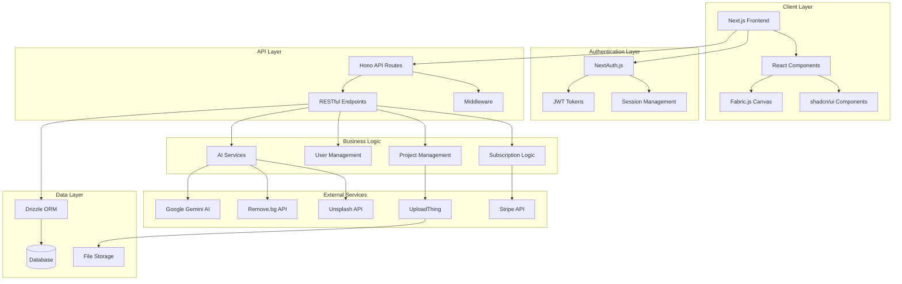
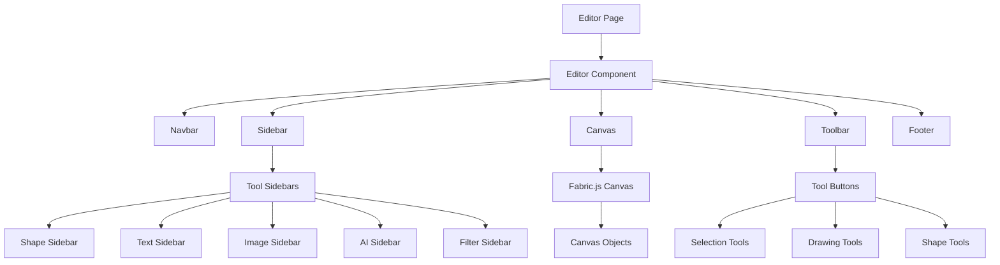

# NYVO
## AI-Powered Design Editor & Canvas Platform

[](https://www.typescriptlang.org/)
[](https://nextjs.org/)
[](https://reactjs.org/)
[](https://tailwindcss.com/)
[](https://fabricjs.com/)
[](https://stripe.com/)

> A modern, full-featured design editor built with Next.js and Fabric.js, featuring AI-powered image generation, collaborative tools, and subscription-based access.

## 🚀 Overview

NYVO is a comprehensive web-based design platform that combines the power of AI with intuitive design tools. Users can create, edit, and collaborate on designs with features ranging from basic shape manipulation to advanced AI-powered image generation and background removal.

### ✨ Key Features

- **🎨 Advanced Canvas Editor**: Full-featured design editor with Fabric.js integration
- **🤖 AI Integration**: 
  - AI-powered image generation via Google Gemini
  - Intelligent background removal using Remove.bg API
- **📁 Project Management**: Create, save, duplicate, and organize design projects
- **🖼️ Rich Media Support**: 
  - Image uploads via UploadThing
  - Stock images from Unsplash integration
  - Multiple export formats (PNG, JPG, SVG, PDF)
- **🎭 Design Tools**:
  - Vector shapes and drawing tools
  - Advanced text editing with rich formatting
  - Color pickers and gradient tools
  - Filters and effects
  - Layer management
- **👥 User Management**: Secure authentication with NextAuth.js
- **💳 Subscription System**: Stripe-powered billing and subscription management
- **📱 Responsive Design**: Optimized for desktop and tablet experiences

## 🏗️ High-Level System Architecture



## 🗂️ Project Structure

```
nyvo/
├── src/
│   ├── app/                     # Next.js App Router
│   │   ├── (auth)/             # Authentication routes
│   │   │   ├── sign-in/        # Sign-in page
│   │   │   └── sign-up/        # Sign-up page
│   │   ├── (dashboard)/        # Dashboard layout & components
│   │   │   ├── page.tsx        # Main dashboard
│   │   │   ├── sidebar.tsx     # Navigation sidebar
│   │   │   └── templates/      # Template management
│   │   ├── editor/[projectId]/ # Design editor
│   │   └── api/                # API routes
│   │       ├── [[...route]]/   # Hono API handlers
│   │       ├── auth/           # NextAuth configuration
│   │       └── uploadthing/    # File upload handlers
│   ├── components/             # Shared components
│   │   ├── ui/                 # shadcn/ui components
│   │   ├── modals.tsx          # Modal management
│   │   └── providers.tsx       # Context providers
│   ├── features/               # Feature-based organization
│   │   ├── auth/               # Authentication logic
│   │   ├── editor/             # Editor components & hooks
│   │   │   ├── components/     # Editor UI components
│   │   │   ├── hooks/          # Editor-specific hooks
│   │   │   └── types.ts        # Type definitions
│   │   ├── projects/           # Project management
│   │   ├── subscriptions/      # Billing & subscriptions
│   │   ├── images/             # Image handling
│   │   └── ai/                 # AI integration
│   ├── lib/                    # Utility libraries
│   │   ├── gemini.ts          # Google Gemini AI
│   │   ├── removebg.ts        # Remove.bg integration
│   │   ├── stripe.ts          # Stripe configuration
│   │   ├── unsplash.ts        # Unsplash API
│   │   └── uploadthing.ts     # File upload config
│   ├── db/                     # Database configuration
│   │   └── schema.ts          # Drizzle schema
│   └── hooks/                  # Custom React hooks
├── public/                     # Static assets
├── drizzle.config.ts          # Drizzle ORM configuration
├── next.config.ts             # Next.js configuration
├── tailwind.config.js         # Tailwind CSS config
└── package.json              # Dependencies
```

## 🛠️ Tech Stack

### Frontend
- **Framework**: Next.js 14+ (App Router)
- **Language**: TypeScript
- **UI Library**: React 18+
- **Styling**: Tailwind CSS
- **Components**: shadcn/ui
- **Icons**: Lucide React
- **Canvas**: Fabric.js

### Backend
- **API Framework**: Hono
- **Authentication**: NextAuth.js
- **ORM**: Drizzle ORM
- **File Uploads**: UploadThing
- **Validation**: Zod

### External Integrations
- **AI Services**: Google Gemini AI
- **Image Processing**: Remove.bg API
- **Stock Images**: Unsplash API
- **Payments**: Stripe
- **Analytics**: (Implementation ready)

### Development Tools
- **Linting**: ESLint
- **Type Checking**: TypeScript
- **Build Tool**: Next.js built-in
- **Package Manager**: npm/pnpm/yarn

## 📋 Prerequisites

- Node.js 18+ 
- npm/pnpm/yarn
- Database (PostgreSQL recommended)

## 🚀 Quick Start

### 1. Clone the Repository
```bash
git clone https://github.com/ismail-gits/nyvo.git
cd nyvo
```

### 2. Install Dependencies
```bash
npm install
# or
pnpm install
```

### 3. Environment Setup
Create a `.env.local` file in the root directory:

```env
# Database
DATABASE_URL="your-database-url"

# NextAuth
NEXTAUTH_SECRET="your-nextauth-secret"
NEXTAUTH_URL="http://localhost:3000"

# Google Gemini AI
GOOGLE_GEMINI_API_KEY="your-gemini-api-key"

# Remove.bg
REMOVEBG_API_KEY="your-removebg-api-key"

# Unsplash
UNSPLASH_ACCESS_KEY="your-unsplash-access-key"

# UploadThing
UPLOADTHING_SECRET="your-uploadthing-secret"
UPLOADTHING_APP_ID="your-uploadthing-app-id"

# Stripe
STRIPE_PUBLISHABLE_KEY="your-stripe-publishable-key"
STRIPE_SECRET_KEY="your-stripe-secret-key"
STRIPE_WEBHOOK_SECRET="your-stripe-webhook-secret"
```

### 4. Database Setup
```bash
# Generate and push database schema
npm run db:generate
npm run db:push
```

### 5. Start Development Server
```bash
npm run dev
```

Visit `http://localhost:3000` to see the application.

## 🎯 Core Features Deep Dive

### Design Editor
The editor is built on Fabric.js and provides:
- **Canvas Management**: Multi-layer design canvas with zoom and pan
- **Shape Tools**: Rectangles, circles, triangles, custom paths
- **Text Tools**: Rich text editing with fonts, colors, and formatting
- **Image Tools**: Upload, crop, filter, and manipulate images
- **Drawing Tools**: Freehand drawing with customizable brushes
- **Selection Tools**: Multi-select, group/ungroup, alignment tools

### AI Integration
- **Image Generation**: Create images from text prompts using Google Gemini
- **Background Removal**: Automatically remove backgrounds from images
- **Smart Suggestions**: AI-powered design recommendations

### Project Management
- **Project CRUD**: Create, read, update, delete projects
- **Template System**: Pre-built templates for quick starts
- **Export Options**: Multiple format exports (PNG, JPG, SVG, PDF)
- **Version Control**: Save and restore project states

### Subscription System
- **Tiered Access**: Free and premium subscription tiers
- **Usage Limits**: API call limits for AI features
- **Billing Integration**: Automated billing via Stripe
- **Paywall Logic**: Feature gating based on subscription status

## 🔧 API Endpoints

### Authentication
- `POST /api/auth/signin` - User sign-in
- `POST /api/auth/signup` - User registration
- `POST /api/auth/signout` - User sign-out

### Projects
- `GET /api/projects` - List user projects
- `POST /api/projects` - Create new project
- `GET /api/projects/:id` - Get project details
- `PUT /api/projects/:id` - Update project
- `DELETE /api/projects/:id` - Delete project
- `POST /api/projects/:id/duplicate` - Duplicate project

### AI Services
- `POST /api/ai/generate-image` - Generate image from text
- `POST /api/ai/remove-background` - Remove image background

### Images
- `GET /api/images` - Get Unsplash images
- `POST /api/uploadthing` - Upload user images

### Subscriptions
- `GET /api/subscriptions` - Get user subscription
- `POST /api/subscriptions/checkout` - Create checkout session
- `POST /api/subscriptions/billing` - Manage billing portal

## 🎨 Component Architecture



## 🔒 Security Features

- **Authentication**: Secure JWT-based authentication
- **Authorization**: Role-based access control
- **Input Validation**: Zod schema validation
- **CORS Protection**: Configured CORS policies
- **Rate Limiting**: API rate limiting implementation
- **Data Sanitization**: XSS protection

## 🚀 Deployment

### Prerequisites
- Database server (PostgreSQL/MySQL)
- File storage service
- Environment variables configured

### Environment Variables
Ensure all required environment variables are set in production:
- Database connection strings
- API keys for external services
- Authentication secrets
- Stripe configuration

### Build and Deploy
```bash
# Build the application
npm run build

# Start production server
npm start
```

## 🤝 Contributing

1. Fork the repository
2. Create a feature branch (`git checkout -b feature/amazing-feature`)
3. Commit your changes (`git commit -m 'Add some amazing feature'`)
4. Push to the branch (`git push origin feature/amazing-feature`)
5. Open a Pull Request

## 📝 License

This project is licensed under the MIT License - see the [LICENSE](LICENSE) file for details.

## 👨‍💻 Author

**Ismail**
- GitHub: [@ismail-gits](https://github.com/ismail-gits)

## 🆘 Support

For support, please open an issue in the GitHub repository or contact the development team.

## 🗺️ Roadmap

- [ ] Real-time collaboration features
- [ ] Mobile app development
- [ ] Advanced AI features
- [ ] Plugin system
- [ ] Team management features
- [ ] Advanced analytics dashboard

---

⭐ **Star this repo if you find it helpful!**
